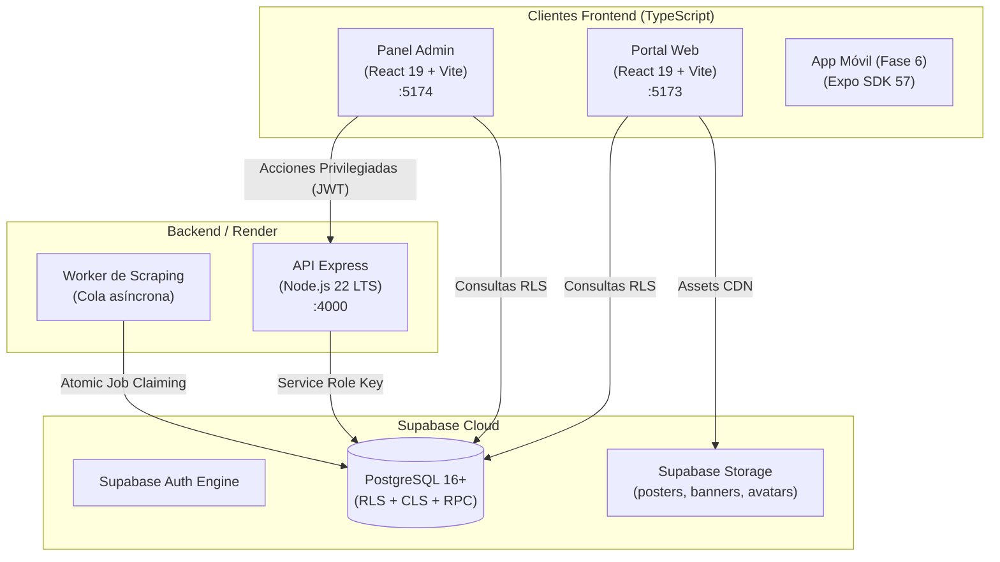

# ⛩️ TotalAnime 2.0

> **Plataforma Integral de Streaming de Anime de Nueva Generación**  
> *Arquitectura Híbrida BaaS-First (Zero-PHP) | 100% TypeScript & JavaScript*

---

## 📑 Tabla de Contenidos

1. [Visión General del Proyecto](#-visión-general-del-proyecto)
2. [Stack Tecnológico](#-stack-tecnológico)
3. [Estructura del Repositorio](#-estructura-del-repositorio)
4. [Requisitos Previos](#-requisitos-previos)
5. [Configuración Inicial y Variables de Entorno](#-configuración-inicial-y-variables-de-entorno)
6. [Comandos para Iniciar los Módulos](#-comandos-para-iniciar-los-módulos)
   - [6.1 Iniciar desde la Raíz (Recomendado)](#61-iniciar-desde-la-raíz-del-proyecto-recomendado)
   - [6.2 Iniciar desde cada Subdirectorio](#62-iniciar-entrando-a-cada-subdirectorio)
7. [Compilación para Producción (Build)](#-compilación-para-producción-build)
8. [Ejecución de Pruebas (Testing)](#-ejecución-de-pruebas-testing)
9. [Base de Datos y Migraciones (Supabase)](#-base-de-datos-y-migraciones-supabase)
10. [Seguridad y Control de Acceso (RBAC)](#-seguridad-y-control-de-acceso-rbac)

---

## 🌟 Visión General del Proyecto

**TotalAnime 2.0** es una refundación completa de la plataforma legacy hacia un ecosistema moderno, escalable y seguro:

- **Frontend Web:** Cliente SPA reactivo y veloz para usuarios finales con reproductor multi-servidor, historial con reanudación y lista de seguimiento.
- **Panel de Administración:** Dashboard con RBAC estricto para moderadores y administradores, gestión de catálogo, auditoría y editor de fuentes de video.
- **API & Workers:** Microservicio en Node.js para scraping seguro (protección SSRF, cuarentena automática), sincronización AniList y cola asíncrona de jobs.
- **Base de Datos & Auth:** PostgreSQL en Supabase con Row Level Security (RLS), Column-Level Security (CLS) y almacenamiento de assets en Supabase Storage.



---

## 🛠️ Stack Tecnológico

| Módulo | Tecnologías |
| :--- | :--- |
| **Web (`web/`)** | React 19, Vite, Tailwind CSS, TanStack Query, React Router v7, Lucide Icons |
| **Admin (`admin/`)** | React 19, Vite, Tailwind CSS, TanStack Query, React Router v7, Lucide Icons |
| **API & Workers (`api/`)** | Node.js 22 LTS, Express, TypeScript, Cheerio, Axios, Zod, Vitest |
| **Base de Datos (`supabase/`)** | PostgreSQL 16+, PostgREST, GoTrue (Auth), Supabase Storage |
| **ETL & Scripts (`scripts/`)** | TypeScript (`tsx`), pg, Supabase JS |
| **Móvil (`app/`)** | Expo SDK 57, React Native 0.86 *(Planeada para Fase 6)* |

---

## 📂 Estructura del Repositorio

```text
totalanime/
├── web/                 # Aplicación Web SPA para usuarios finales
├── admin/               # Panel de Administración y Moderación
├── api/                 # Microservicio API REST y Workers en Node.js
├── app/                 # Aplicación móvil (React Native / Expo)
├── supabase/            # DDL, migraciones, RLS, Grants y Storage de PostgreSQL
├── scripts/             # Scripts ETL de migración y utilidades de desarrollo
├── videos-api/          # Módulos legacy de extracción/scraping
├── package.json         # Scripts maestros y dependencias de la raíz
└── plan.md              # Especificación técnica y plan de arquitectura completo
```

---

## 📋 Requisitos Previos

- **Node.js:** Versión 22.0.0 LTS o superior (`node -v`)
- **npm:** Versión 10.0.0 o superior (`npm -v`)
- **Proyecto Supabase:** Cuenta en [Supabase Cloud](https://supabase.com) o [Supabase CLI](https://supabase.com/docs/guides/cli) para desarrollo local.

---

## ⚙️ Configuración Inicial y Variables de Entorno

Antes de iniciar los servicios, instala las dependencias y configura los archivos `.env` en cada módulo:

### 1. Instalar Dependencias

```bash
# En la raíz del proyecto
npm install

# En cada submódulo
npm --prefix api install
npm --prefix admin install
npm --prefix web install
```

### 2. Configurar Archivos `.env`

#### 🔹 Raíz (`.env`):
```env
SUPABASE_URL=https://<tu-proyecto>.supabase.co
SUPABASE_SECRET_KEY=tu_service_role_o_secret_key
PASSWORD_RESET_REDIRECT_URL=https://totalanime.com/auth/reset-password
```

#### 🔹 API Backend (`api/.env`):
Copia `api/.env.example` a `api/.env`:
```env
PORT=4000
NODE_ENV=development
SUPABASE_URL=https://<tu-proyecto>.supabase.co
SUPABASE_SECRET_KEY=tu_service_role_o_secret_key
SUPABASE_JWT_SECRET=tu_jwt_secret_minimo_32_caracteres
SCRAPER_BASE_URL=https://tioanime.com/
CORS_ORIGINS=http://localhost:5173,http://localhost:5174,http://localhost:3000
WORKER_POLL_INTERVAL_MS=5000
```

#### 🔹 Panel Admin (`admin/.env`):
Copia `admin/.env.example` a `admin/.env`:
```env
VITE_SUPABASE_URL=https://<tu-proyecto>.supabase.co
VITE_SUPABASE_PUBLISHABLE_KEY=tu_supabase_publishable_o_anon_key
VITE_API_URL=http://localhost:4000
VITE_WEB_URL=http://localhost:5173
```

#### 🔹 Portal Web (`web/.env`):
Copia `web/.env.example` a `web/.env`:
```env
VITE_SUPABASE_URL=https://<tu-proyecto>.supabase.co
VITE_SUPABASE_ANON_KEY=tu_supabase_anon_key
VITE_API_URL=http://localhost:4000
```

---

## 🚀 Comandos para Iniciar los Módulos

Puedes iniciar cada aplicación de dos formas:

### 6.1 Iniciar desde la Raíz del Proyecto (Recomendado)

Desde la carpeta principal `totalanime/`, abre terminales independientes para los servicios que necesites:

| Servicio | Comando | URL / Puerto |
| :--- | :--- | :--- |
| 🌐 **Portal Web** | `npm run web:dev` | [http://localhost:5173](http://localhost:5173) |
| 🛡️ **Panel Admin** | `npm run admin:dev` | [http://localhost:5174](http://localhost:5174) |
| ⚡ **API Backend** | `npm run api:dev` | [http://localhost:4000](http://localhost:4000) |
| 🤖 **Worker de Scraping** | `npm run api:worker` | Ejecuta polling de jobs en BD |

---

### 6.2 Iniciar Entrando a cada Subdirectorio

Si prefieres trabajar directamente dentro de cada módulo:

#### 🌐 1. Iniciar la Web:
```bash
cd web
npm run dev
```

#### 🛡️ 2. Iniciar el Panel de Administración:
```bash
cd admin
npm run dev
```

#### ⚡ 3. Iniciar la API Backend:
```bash
cd api
npm run dev
```

#### 🤖 4. Iniciar el Worker de Tareas en Segundo Plano:
```bash
cd api
npm run worker:dev
```

---

## 📦 Compilación para Producción (Build)

Para validar tipos TypeScript y generar los bundles optimizados en `dist/`:

### Compilar Todo el Ecosistema a la vez:
```bash
npm run build
```

### Compilar Módulos Individualmente:
- **Compilar Web:** `npm run web:build`
- **Compilar Admin:** `npm run admin:build`
- **Compilar API:** `npm run api:build`

---

## 🧪 Ejecución de Pruebas (Testing)

Ejecuta las suites de tests unitarios basadas en **Vitest**:

```bash
# Correr todos los tests del proyecto
npm run test

# Tests específicos de cada módulo
npm run web:test       # Tests del cliente web
npm run admin:test     # Tests del panel de administración
npm run api:test       # Tests del backend y scrapers
```

---

## 🗄️ Base de Datos y Migraciones (Supabase)

La base de datos utiliza PostgreSQL con seguridad avanzada.

### Orden de Ejecución en Supabase SQL Editor:
1. `supabase/schema.sql` — Extensiones, tablas, enums, triggers y funciones.
2. `supabase/rls.sql` — Políticas RLS y funciones de autorización `SECURITY DEFINER`.
3. `supabase/grants.sql` — Concesión y revocación determinista de permisos por columna.
4. `supabase/storage.sql` — Creación de buckets (`posters`, `banners`, `avatars`, `thumbnails`) y políticas de Storage.

### Scripts de Migración y Desarrollo:
```bash
# Resetear base de datos local con Supabase CLI
npm run db:reset

# Probar políticas RLS locales
npm run db:test

# Migrar datos del backup legacy
npm run migrate:data

# Migrar usuarios legacy con hash y Admin API
npm run migrate:users

# Configurar contraseñas de desarrollo para testing
npm run set:dev-passwords
```

---

## 🛡️ Seguridad y Control de Acceso (RBAC)

El sistema maneja 3 roles jerárquicos:

1. **`user` (Usuario Estándar):**
   - Acceso al portal público, historial personal, lista de seguimiento y modificación de su propio perfil.
2. **`moderator` (Moderador):**
   - Acceso al panel `admin/`.
   - Creación y edición de animes y episodios.
   - Reclamación de animes libres (`claim_anime`).
   - Deshabilitación suave de fuentes de video.
3. **`admin` (Administrador Total):**
   - Acceso total.
   - Eliminación permanente de animes y episodios.
   - Gestión de roles de usuario, logs de auditoría (`audit_logs`) y ajustes del sistema.

---

<p align="center">
  <b>TotalAnime 2.0</b> — Desarrollado con ❤️ para la comunidad de anime.
</p>
