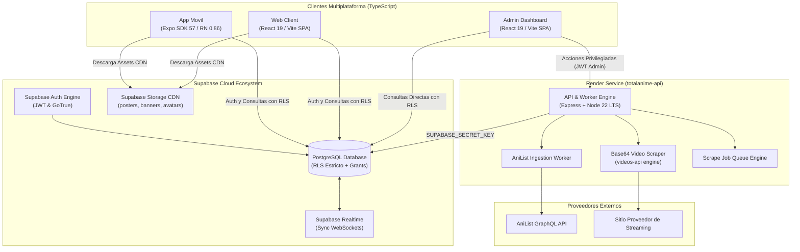
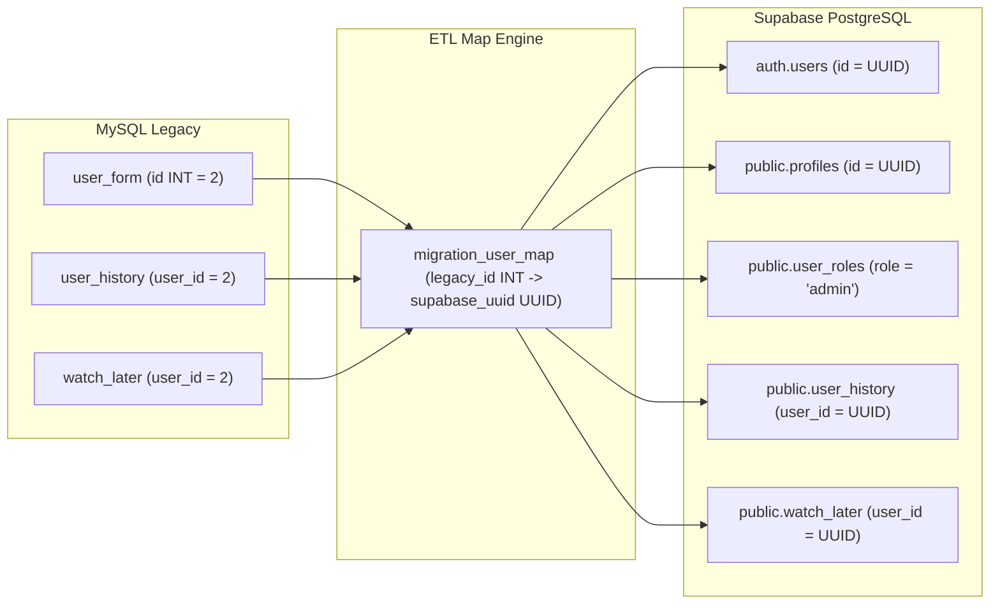
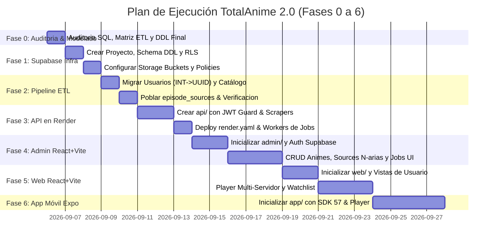

# 🏛️ Especificación Técnica y Plan Maestro Integral: TotalAnime 2.0 (v2.4.1 Final)

> **Documento de Diseño Técnico Definitivo (Master RFC / Architecture Blueprint - Cerrado)**  
> **Versión:** 2.4.1 (Production-Ready Final)  
> **Fecha:** 2026-09-05  
> **Estado:** ✅ **FASE 0 APROBADA - CERRADA PARA IMPLEMENTACIÓN**  
> **Paradigma:** 100% JavaScript / TypeScript | BaaS-First Hybrid Architecture | Zero-PHP  
> **Stack:** React 19.2 + Vite (Web y Admin) | Node.js 22 LTS + Express (API/Workers en Render) | Supabase (PostgreSQL 16+ + Auth + Storage + RLS) | React Native 0.86+ + Expo SDK 57 (App Móvil)

---

## 📑 Tabla de Contenidos

1. [Visión General y Paradigma Arquitectónico](#1-visión-general-y-paradigma-arquitectónico)
2. [Matriz de Migración Legacy (`totalanime (2).sql` $\rightarrow$ TotalAnime 2.0)](#2-matriz-de-migración-legacy-totalanime-2sql--totalanime-20)
3. [Topología y Flujos de Datos del Ecosistema](#3-topología-y-flujos-de-datos-del-ecosistema)
4. [Esquema DDL de Base de Datos PostgreSQL (Supabase)](#4-esquema-ddl-de-base-de-datos-postgresql-supabase)
5. [Seguridad Robusta: RLS, Triggers, RPCs y RBAC Estricto](#5-seguridad-robusta-rls-triggers-rpcs-y-rbac-estricto)
6. [Estrategia Determinista de GRANTs y Privilegios por Columna](#6-estrategia-determinista-de-grants-y-privilegios-por-columna)
7. [Políticas de Seguridad en Supabase Storage (Ciclo de Vida Completo)](#7-políticas-de-seguridad-en-supabase-storage-ciclo-de-vida-completo)
8. [Pipeline ETL de Migración de Datos y Mapeo de Usuarios (INT $\rightarrow$ UUID)](#8-pipeline-etl-de-migración-de-datos-y-mapeo-de-usuarios-int--uuid)
9. [Especificación de la API/Workers en Render (`api/`) & Sistema de Jobs](#9-especificación-de-la-apiworkers-en-render-api--sistema-de-jobs)
10. [Arquitectura del Panel de Administración (`admin/` en React 19 + Vite)](#10-arquitectura-del-panel-de-administración-admin-en-react-19--vite)
11. [Arquitectura del Frontend Web (`web/` en React 19 + Vite)](#11-arquitectura-del-frontend-web-web-en-react-19--vite)
12. [Arquitectura de la Aplicación Móvil (`app/` en Expo SDK 57 + RN 0.86)](#12-arquitectura-de-la-aplicación-móvil-app-en-expo-sdk-57--rn-086)
13. [Definición de Tipos e Interfaces Compartidas (TypeScript)](#13-definición-de-tipos-e-interfaces-compartidas-typescript)
14. [Cronograma Reordenado, Fases y Criterios de Aceptación (Fases 0 a 6)](#14-cronograma-reordenado-fases-y-criterios-de-aceptación-fases-0-a-6)

---

## 1. Visión General y Paradigma Arquitectónico

### 1.1 Naturaleza de la Arquitectura: BaaS-First Híbrida
TotalAnime 2.0 adopta una arquitectura **BaaS-First Híbrida**:
- **Supabase BaaS:** Fuente de verdad central. Clientes (Web, Admin y App Móvil) consumen directamente PostgreSQL vía PostgREST con políticas **Row Level Security (RLS)** y privilegios por columna (**Column-Level Security**). Sesiones gestionadas vía Supabase Auth (JWT) y CDN con Supabase Storage.
- **API en Render (Workers & Scrapers):** Microservicio en Node.js 22 LTS exclusivo para scraping Base64 de servidores de video (`videos-api`), cola asíncrona de jobs (`scrape_jobs`), ingesta AniList GraphQL y mutaciones privilegiadas vía `SUPABASE_SECRET_KEY`.
- **Zero-PHP:** El monolito legacy de Laragon se utiliza exclusivamente como backup histórico de datos.

---

## 2. Matriz de Migración Legacy (`totalanime (2).sql` $\rightarrow$ TotalAnime 2.0)

| Tabla Legacy (MySQL) | Destino en TotalAnime 2.0 | Acción | Justificación Técnica |
| :--- | :--- | :--- | :--- |
| `user_form` | `auth.users` + `public.profiles` + `public.user_roles` | **Transformar (ETL)** | Separación de identidad (Auth), perfil público (`profiles`) y autorización (`user_roles`). Requerirá reset de contraseña (eliminación de MD5). |
| `user_sessions` | `auth.sessions` (Supabase nativo) | **Eliminar** | Supabase Auth maneja sesiones, refresh tokens y rotación JWT de forma nativa. |
| `rate_limits` | Middleware API + Supabase Auth Rate Limiting | **Eliminar** | La base de datos no almacena rate-limiting volátil; se maneja en Edge/Redis. |
| `security_logs` | `public.audit_logs` | **Rediseñar** | Registro de auditoría *append-only* para acciones críticas de moderadores y administradores. |
| `system_config` | `public.app_settings` | **Transformar** | Clave/Valor para configuración global pública (**cero secretos**). |
| `system_notifications` | `public.admin_notifications` | **Transformar** | Alertas operativas de próximos estrenos para moderadores/admins. |
| `pageview` | `public.anime_views` + `views_count` | **Rediseñar** | `views_count` en `animes`/`episodes` para lectura O(1) y `anime_views` para agregación diaria particionada por fecha. |
| `google` | *N/A* | **Eliminar** | Tabla residual legacy sin uso real. |
| `genres` | `public.genres` | **Migrar (1:1)** | Catálogo oficial de 19 géneros. |
| `avatars` | `public.avatars` + Supabase Storage | **Migrar** | 13 avatares predeterminados en bucket `avatars`. |
| `animes` | `public.animes` | **Transformar** | Se elimina la columna redundante `genres TEXT` (la fuente de verdad es `anime_genres`). Se conservan campos de emisión y títulos multilingües. |
| `anime_genres` | `public.anime_genres` | **Migrar (1:1)** | Tabla relacional N:M de animes y géneros. |
| `episodes` | `public.episodes` | **Transformar** | Se eliminan las columnas rígidas `video_url1/2/3`. Se añade `air_at TIMESTAMPTZ`. |
| *N/A (Nueva)* | `public.episode_sources` | **Crear** | **Soporte N-ario de servidores de video** con clave única para idempotencia (`episode_id, provider, language, quality`). |
| *N/A (Nueva)* | `public.scrape_jobs` | **Crear** | Cola de tareas de scraping asíncrono para series largas. |
| `user_history` | `public.user_history` | **Normalizar (ETL)** | Se eliminan columnas desnormalizadas (`anime_title`, `anime_image`, etc.). Mapeo de `user_id` de `INT` a `UUID`. |
| `user_episode_status` | `public.user_episode_status` | **Transformar (ETL)** | Mapeo de `user_id` de `INT` a `UUID`. |
| `watch_later` | `public.watch_later` | **Normalizar (ETL)** | Se eliminan columnas desnormalizadas (`name`, `image`, etc.). Mapeo de `user_id` de `INT` a `UUID`. |

---

## 3. Topología y Flujos de Datos del Ecosistema



---

## 4. Esquema DDL de Base de Datos PostgreSQL (Supabase)

```sql
-- ========================================================
-- 1. EXTENSIONES
-- ========================================================
CREATE EXTENSION IF NOT EXISTS "uuid-ossp";
CREATE EXTENSION IF NOT EXISTS "pg_trgm";

-- ========================================================
-- 2. ENUMS Y TIPOS
-- ========================================================
CREATE TYPE user_role AS ENUM ('user', 'moderator', 'admin');
CREATE TYPE user_status AS ENUM ('active', 'suspended', 'banned');
CREATE TYPE episode_status AS ENUM ('pending', 'available', 'unavailable');
CREATE TYPE notification_type AS ENUM ('3_days', '2_days', '1_day');
CREATE TYPE stream_language AS ENUM ('sub', 'dub');
CREATE TYPE job_status AS ENUM ('pending', 'processing', 'completed', 'failed');

-- ========================================================
-- 3. PERFILES PÚBLICOS (public.profiles)
-- Sin email ni roles para máxima privacidad y seguridad
-- ========================================================
CREATE TABLE public.profiles (
    id UUID PRIMARY KEY REFERENCES auth.users(id) ON DELETE CASCADE,
    username VARCHAR(100) UNIQUE NOT NULL,
    avatar_url VARCHAR(255) DEFAULT 'default-avatar.png',
    bio TEXT DEFAULT '',
    created_at TIMESTAMPTZ DEFAULT NOW() NOT NULL,
    updated_at TIMESTAMPTZ DEFAULT NOW() NOT NULL
);

-- ========================================================
-- 4. ROLES Y ESTADOS DE USUARIO (public.user_roles)
-- Separado de profiles: SOLO modificable por Admins
-- ========================================================
CREATE TABLE public.user_roles (
    user_id UUID PRIMARY KEY REFERENCES auth.users(id) ON DELETE CASCADE,
    role user_role DEFAULT 'user' NOT NULL,
    status user_status DEFAULT 'active' NOT NULL,
    updated_by UUID REFERENCES auth.users(id) ON DELETE SET NULL,
    updated_at TIMESTAMPTZ DEFAULT NOW() NOT NULL
);

-- Trigger de Registro Seguro con Manejo de Colisiones de Username y Concurrencia
CREATE OR REPLACE FUNCTION public.handle_new_user()
RETURNS TRIGGER
LANGUAGE plpgsql
SECURITY DEFINER
SET search_path = ''
AS $$
DECLARE
    base_username TEXT;
    final_username TEXT;
    counter INT := 1;
BEGIN
    base_username := COALESCE(NULLIF(TRIM(NEW.raw_user_meta_data->>'username'), ''), SPLIT_PART(NEW.email, '@', 1));
    final_username := base_username;

    -- Manejar colisiones de username en bucle transaccional
    LOOP
        BEGIN
            INSERT INTO public.profiles (id, username, avatar_url)
            VALUES (NEW.id, final_username, 'default-avatar.png');
            EXIT; -- Inserción exitosa
        EXCEPTION WHEN unique_violation THEN
            counter := counter + 1;
            final_username := base_username || '_' || counter;
        END;
    END LOOP;

    -- Asignar Rol 'user' incondicionalmente
    INSERT INTO public.user_roles (user_id, role, status)
    VALUES (NEW.id, 'user', 'active');

    RETURN NEW;
END;
$$;

CREATE TRIGGER on_auth_user_created
    AFTER INSERT ON auth.users
    FOR EACH ROW EXECUTE FUNCTION public.handle_new_user();

-- ========================================================
-- 5. TABLA DE GÉNEROS (public.genres)
-- ========================================================
CREATE TABLE public.genres (
    id SERIAL PRIMARY KEY,
    name VARCHAR(100) NOT NULL UNIQUE,
    slug VARCHAR(120) NOT NULL UNIQUE
);

-- ========================================================
-- 6. TABLA DE AVATARES PREDEFINIDOS (public.avatars)
-- ========================================================
CREATE TABLE public.avatars (
    id SERIAL PRIMARY KEY,
    filename VARCHAR(255) NOT NULL,
    is_default BOOLEAN DEFAULT FALSE,
    created_at TIMESTAMPTZ DEFAULT NOW() NOT NULL,
    updated_at TIMESTAMPTZ DEFAULT NOW() NOT NULL
);

-- ========================================================
-- 7. TABLA DE ANIMES (public.animes)
-- ========================================================
CREATE TABLE public.animes (
    id SERIAL PRIMARY KEY,
    name VARCHAR(255) NOT NULL,
    title_romaji VARCHAR(255),
    title_english VARCHAR(255),
    title_native VARCHAR(255),
    cover_image TEXT,
    banner_image TEXT,
    status VARCHAR(50) DEFAULT 'FINISHED',
    episodes INT DEFAULT 0,
    description TEXT,
    anilist_id INT UNIQUE,
    claimed_by UUID REFERENCES public.profiles(id) ON DELETE SET NULL,
    claimed_at TIMESTAMPTZ,
    season_year INT,
    format VARCHAR(50) DEFAULT 'TV',
    slug VARCHAR(255) UNIQUE NOT NULL,
    air_day SMALLINT CHECK (air_day BETWEEN 0 AND 6),
    air_time TIME,
    air_timezone VARCHAR(50) DEFAULT 'Asia/Tokyo',
    start_date DATE,
    end_date DATE,
    views_count INT DEFAULT 0,
    created_at TIMESTAMPTZ DEFAULT NOW() NOT NULL,
    updated_at TIMESTAMPTZ DEFAULT NOW() NOT NULL
);

CREATE INDEX idx_animes_slug ON public.animes(slug);
CREATE INDEX idx_animes_anilist_id ON public.animes(anilist_id);
CREATE INDEX idx_animes_name_trgm ON public.animes USING gin (name gin_trgm_ops);

-- ========================================================
-- 8. TABLA RELACIONAL ANIME - GÉNEROS (public.anime_genres)
-- ========================================================
CREATE TABLE public.anime_genres (
    anime_id INT NOT NULL REFERENCES public.animes(id) ON DELETE CASCADE,
    genre_id INT NOT NULL REFERENCES public.genres(id) ON DELETE CASCADE,
    PRIMARY KEY (anime_id, genre_id)
);

-- ========================================================
-- 9. TABLA DE EPISODIOS (public.episodes)
-- ========================================================
CREATE TABLE public.episodes (
    id SERIAL PRIMARY KEY,
    anime_id INT NOT NULL REFERENCES public.animes(id) ON DELETE CASCADE,
    episode_number INT NOT NULL,
    title VARCHAR(255),
    description TEXT,
    duration INT,
    thumbnail TEXT,
    air_at TIMESTAMPTZ,
    status episode_status DEFAULT 'pending' NOT NULL,
    views INT DEFAULT 0,
    created_by UUID REFERENCES public.profiles(id) ON DELETE SET NULL,
    created_at TIMESTAMPTZ DEFAULT NOW() NOT NULL,
    updated_at TIMESTAMPTZ DEFAULT NOW() NOT NULL,
    UNIQUE(anime_id, episode_number)
);

CREATE INDEX idx_episodes_anime_id ON public.episodes(anime_id);
CREATE INDEX idx_episodes_air_at ON public.episodes(air_at);

-- ========================================================
-- 10. FUENTES DE VIDEO DINÁMICAS (public.episode_sources)
-- Idempotencia garantizada por UNIQUE (episode_id, provider, language, quality)
-- ========================================================
CREATE TABLE public.episode_sources (
    id BIGSERIAL PRIMARY KEY,
    episode_id INT NOT NULL REFERENCES public.episodes(id) ON DELETE CASCADE,
    provider VARCHAR(50) NOT NULL, -- 'mega', 'streamtape', 'streamwish', 'filemoon'
    server_name VARCHAR(100) NOT NULL,
    embed_url TEXT NOT NULL,
    direct_stream_url TEXT,
    language stream_language DEFAULT 'sub' NOT NULL,
    quality VARCHAR(20) DEFAULT '1080p' NOT NULL,
    priority SMALLINT DEFAULT 1 NOT NULL,
    is_active BOOLEAN DEFAULT TRUE NOT NULL,
    last_verified_at TIMESTAMPTZ,
    created_at TIMESTAMPTZ DEFAULT NOW() NOT NULL,
    updated_at TIMESTAMPTZ DEFAULT NOW() NOT NULL,
    CONSTRAINT uq_episode_source UNIQUE (episode_id, provider, language, quality)
);

CREATE INDEX idx_episode_sources_ep ON public.episode_sources(episode_id, is_active);

-- ========================================================
-- 11. COLA DE SCRAPING ASÍNCRONO (public.scrape_jobs)
-- ========================================================
CREATE TABLE public.scrape_jobs (
    id UUID PRIMARY KEY DEFAULT gen_random_uuid(),
    anime_id INT NOT NULL REFERENCES public.animes(id) ON DELETE CASCADE,
    status job_status DEFAULT 'pending' NOT NULL,
    total_episodes INT DEFAULT 0 NOT NULL,
    processed_episodes INT DEFAULT 0 NOT NULL,
    failed_episodes INT DEFAULT 0 NOT NULL,
    error_log JSONB DEFAULT '[]'::jsonb,
    requested_by UUID REFERENCES auth.users(id) ON DELETE SET NULL,
    created_at TIMESTAMPTZ DEFAULT NOW() NOT NULL,
    updated_at TIMESTAMPTZ DEFAULT NOW() NOT NULL
);

CREATE INDEX idx_scrape_jobs_status ON public.scrape_jobs(status);

-- ========================================================
-- 12. TABLA DE AUDITORÍA APPEND-ONLY (public.audit_logs)
-- ========================================================
CREATE TABLE public.audit_logs (
    id BIGSERIAL PRIMARY KEY,
    actor_id UUID REFERENCES auth.users(id) ON DELETE SET NULL,
    action VARCHAR(100) NOT NULL,
    entity_type VARCHAR(50) NOT NULL,
    entity_id VARCHAR(100),
    metadata JSONB DEFAULT '{}'::jsonb NOT NULL,
    ip INET,
    created_at TIMESTAMPTZ DEFAULT NOW() NOT NULL
);

CREATE INDEX idx_audit_logs_actor ON public.audit_logs(actor_id, created_at DESC);

-- ========================================================
-- 13. ANALÍTICA DIARIA DE VISTAS (public.anime_views)
-- ========================================================
CREATE TABLE public.anime_views (
    id BIGSERIAL PRIMARY KEY,
    anime_id INT NOT NULL REFERENCES public.animes(id) ON DELETE CASCADE,
    view_date DATE DEFAULT CURRENT_DATE NOT NULL,
    views_count INT DEFAULT 1 NOT NULL,
    UNIQUE(anime_id, view_date)
);

-- ========================================================
-- 14. TABLA DE NOTIFICACIONES ADMINISTRATIVAS (public.admin_notifications)
-- ========================================================
CREATE TABLE public.admin_notifications (
    id SERIAL PRIMARY KEY,
    anime_id INT NOT NULL REFERENCES public.animes(id) ON DELETE CASCADE,
    episode_id INT NOT NULL REFERENCES public.episodes(id) ON DELETE CASCADE,
    moderator_id UUID NOT NULL REFERENCES public.profiles(id) ON DELETE CASCADE,
    notification_type notification_type NOT NULL,
    episode_air_date DATE NOT NULL,
    notification_date DATE NOT NULL,
    is_read BOOLEAN DEFAULT FALSE,
    created_at TIMESTAMPTZ DEFAULT NOW() NOT NULL
);

-- ========================================================
-- 15. TABLA DE HISTORIAL DE USUARIO (public.user_history)
-- ========================================================
CREATE TABLE public.user_history (
    id BIGSERIAL PRIMARY KEY,
    user_id UUID NOT NULL REFERENCES public.profiles(id) ON DELETE CASCADE,
    episode_id INT NOT NULL REFERENCES public.episodes(id) ON DELETE CASCADE,
    progress_seconds INT DEFAULT 0 NOT NULL,
    total_seconds INT DEFAULT 0 NOT NULL,
    is_completed BOOLEAN DEFAULT FALSE NOT NULL,
    created_at TIMESTAMPTZ DEFAULT NOW() NOT NULL,
    updated_at TIMESTAMPTZ DEFAULT NOW() NOT NULL,
    UNIQUE(user_id, episode_id)
);

CREATE INDEX idx_user_history_user_id ON public.user_history(user_id, updated_at DESC);

-- ========================================================
-- 16. ESTADO DE EPISODIOS VISTOS (public.user_episode_status)
-- ========================================================
CREATE TABLE public.user_episode_status (
    id BIGSERIAL PRIMARY KEY,
    user_id UUID NOT NULL REFERENCES public.profiles(id) ON DELETE CASCADE,
    episode_id INT NOT NULL REFERENCES public.episodes(id) ON DELETE CASCADE,
    is_watched BOOLEAN DEFAULT FALSE NOT NULL,
    watched_at TIMESTAMPTZ,
    created_at TIMESTAMPTZ DEFAULT NOW() NOT NULL,
    updated_at TIMESTAMPTZ DEFAULT NOW() NOT NULL,
    UNIQUE(user_id, episode_id)
);

-- ========================================================
-- 17. WATCHLIST / FAVORITOS (public.watch_later)
-- ========================================================
CREATE TABLE public.watch_later (
    id BIGSERIAL PRIMARY KEY,
    user_id UUID NOT NULL REFERENCES public.profiles(id) ON DELETE CASCADE,
    anime_id INT NOT NULL REFERENCES public.animes(id) ON DELETE CASCADE,
    created_at TIMESTAMPTZ DEFAULT NOW() NOT NULL,
    UNIQUE(user_id, anime_id)
);

CREATE INDEX idx_watch_later_user_id ON public.watch_later(user_id);

-- ========================================================
-- 18. CONFIGURACIÓN GLOBAL PÚBLICA (public.app_settings)
-- ⚠️ ADVERTENCIA: SOLO CONFIGURACIONES PÚBLICAS (CERO SECRETOS / API KEYS)
-- ========================================================
CREATE TABLE public.app_settings (
    key VARCHAR(100) PRIMARY KEY,
    value JSONB NOT NULL,
    description TEXT,
    updated_by UUID REFERENCES auth.users(id) ON DELETE SET NULL,
    updated_at TIMESTAMPTZ DEFAULT NOW() NOT NULL
);
```

---

## 5. Seguridad Robusta: RLS, Triggers, RPCs y RBAC Estricto

### 5.1 Funciones de Seguridad Endurecidas (`SECURITY DEFINER SET search_path = ''`)

```sql
-- Helper: ¿Es Usuario Activo?
CREATE OR REPLACE FUNCTION public.is_active_user()
RETURNS BOOLEAN
LANGUAGE plpgsql
SECURITY DEFINER
SET search_path = ''
AS $$
BEGIN
    RETURN EXISTS (
        SELECT 1 FROM public.user_roles
        WHERE user_id = auth.uid() AND status = 'active'
    );
END;
$$;

-- Helper: ¿Es Administrador?
CREATE OR REPLACE FUNCTION public.is_admin()
RETURNS BOOLEAN
LANGUAGE plpgsql
SECURITY DEFINER
SET search_path = ''
AS $$
BEGIN
    RETURN EXISTS (
        SELECT 1 FROM public.user_roles
        WHERE user_id = auth.uid() AND role = 'admin' AND status = 'active'
    );
END;
$$;

-- Helper: ¿Es Moderador o Administrador?
CREATE OR REPLACE FUNCTION public.is_moderator_or_admin()
RETURNS BOOLEAN
LANGUAGE plpgsql
SECURITY DEFINER
SET search_path = ''
AS $$
BEGIN
    RETURN EXISTS (
        SELECT 1 FROM public.user_roles
        WHERE user_id = auth.uid() AND role IN ('admin', 'moderator') AND status = 'active'
    );
END;
$$;

-- Función RPC: Reclamar Anime de Forma Segura (Evita bypass en UPDATE animes)
CREATE OR REPLACE FUNCTION public.claim_anime(p_anime_id INT)
RETURNS BOOLEAN
LANGUAGE plpgsql
SECURITY DEFINER
SET search_path = ''
AS $$
BEGIN
    IF NOT public.is_moderator_or_admin() THEN
        RAISE EXCEPTION 'No tienes permisos de moderación.';
    END IF;

    UPDATE public.animes
    SET claimed_by = auth.uid(),
        claimed_at = NOW()
    WHERE id = p_anime_id 
      AND (claimed_by IS NULL OR public.is_admin());

    IF NOT FOUND THEN
        RAISE EXCEPTION 'El anime ya ha sido reclamado por otro moderador o no existe.';
    END IF;

    RETURN TRUE;
END;
$$;

-- Función RPC: Registrar Visualización Diaria
CREATE OR REPLACE FUNCTION public.record_anime_view(p_anime_id INT)
RETURNS VOID
LANGUAGE plpgsql
SECURITY DEFINER
SET search_path = ''
AS $$
BEGIN
    -- 1. Incrementar contador diario
    INSERT INTO public.anime_views (anime_id, view_date, views_count)
    VALUES (p_anime_id, CURRENT_DATE, 1)
    ON CONFLICT (anime_id, view_date)
    DO UPDATE SET views_count = public.anime_views.views_count + 1;

    -- 2. Incrementar contador global O(1)
    UPDATE public.animes
    SET views_count = views_count + 1
    WHERE id = p_anime_id;
END;
$$;

-- Revocar permisos EXECUTE a PUBLIC
REVOKE EXECUTE ON FUNCTION public.is_active_user FROM PUBLIC;
REVOKE EXECUTE ON FUNCTION public.is_admin FROM PUBLIC;
REVOKE EXECUTE ON FUNCTION public.is_moderator_or_admin FROM PUBLIC;
REVOKE EXECUTE ON FUNCTION public.claim_anime FROM PUBLIC;
REVOKE EXECUTE ON FUNCTION public.record_anime_view FROM PUBLIC;

GRANT EXECUTE ON FUNCTION public.is_active_user TO authenticated;
GRANT EXECUTE ON FUNCTION public.is_admin TO authenticated;
GRANT EXECUTE ON FUNCTION public.is_moderator_or_admin TO authenticated;
GRANT EXECUTE ON FUNCTION public.claim_anime TO authenticated;
GRANT EXECUTE ON FUNCTION public.record_anime_view TO anon, authenticated;
```

### 5.2 Políticas RLS Definitivas

```sql
-- Activar RLS en todas las 14 tablas
ALTER TABLE public.profiles ENABLE ROW LEVEL SECURITY;
ALTER TABLE public.user_roles ENABLE ROW LEVEL SECURITY;
ALTER TABLE public.animes ENABLE ROW LEVEL SECURITY;
ALTER TABLE public.episodes ENABLE ROW LEVEL SECURITY;
ALTER TABLE public.episode_sources ENABLE ROW LEVEL SECURITY;
ALTER TABLE public.genres ENABLE ROW LEVEL SECURITY;
ALTER TABLE public.anime_genres ENABLE ROW LEVEL SECURITY;
ALTER TABLE public.avatars ENABLE ROW LEVEL SECURITY;
ALTER TABLE public.admin_notifications ENABLE ROW LEVEL SECURITY;
ALTER TABLE public.user_history ENABLE ROW LEVEL SECURITY;
ALTER TABLE public.user_episode_status ENABLE ROW LEVEL SECURITY;
ALTER TABLE public.watch_later ENABLE ROW LEVEL SECURITY;
ALTER TABLE public.app_settings ENABLE ROW LEVEL SECURITY;
ALTER TABLE public.audit_logs ENABLE ROW LEVEL SECURITY;
ALTER TABLE public.scrape_jobs ENABLE ROW LEVEL SECURITY;
ALTER TABLE public.anime_views ENABLE ROW LEVEL SECURITY;

-- 1. Profiles & Roles
CREATE POLICY "Profiles: Read All" ON public.profiles FOR SELECT USING (true);
CREATE POLICY "Profiles: Update Self" ON public.profiles FOR UPDATE USING ((select auth.uid()) = id AND (select public.is_active_user()));

CREATE POLICY "UserRoles: Read Self or Admin" ON public.user_roles FOR SELECT USING ((select auth.uid()) = user_id OR (select public.is_admin()));
CREATE POLICY "UserRoles: Admin Write" ON public.user_roles FOR ALL USING ((select public.is_admin()));

-- 2. Catálogo (Moderador: INSERT/UPDATE | Admin: DELETE)
CREATE POLICY "Public: Animes SELECT" ON public.animes FOR SELECT USING (true);
CREATE POLICY "ModAdmin: Animes INSERT" ON public.animes FOR INSERT WITH CHECK ((select public.is_moderator_or_admin()));
CREATE POLICY "ModAdmin: Animes UPDATE" ON public.animes FOR UPDATE USING ((select public.is_moderator_or_admin()));
CREATE POLICY "Admin: Animes DELETE" ON public.animes FOR DELETE USING ((select public.is_admin()));

CREATE POLICY "Public: Episodes SELECT" ON public.episodes FOR SELECT USING (true);
CREATE POLICY "ModAdmin: Episodes INSERT" ON public.episodes FOR INSERT WITH CHECK ((select public.is_moderator_or_admin()));
CREATE POLICY "ModAdmin: Episodes UPDATE" ON public.episodes FOR UPDATE USING ((select public.is_moderator_or_admin()));
CREATE POLICY "Admin: Episodes DELETE" ON public.episodes FOR DELETE USING ((select public.is_admin()));

CREATE POLICY "Public: EpisodeSources SELECT" ON public.episode_sources FOR SELECT USING (is_active = true);
CREATE POLICY "ModAdmin: EpisodeSources INSERT" ON public.episode_sources FOR INSERT WITH CHECK ((select public.is_moderator_or_admin()));
CREATE POLICY "ModAdmin: EpisodeSources UPDATE" ON public.episode_sources FOR UPDATE USING ((select public.is_moderator_or_admin()));
CREATE POLICY "Admin: EpisodeSources DELETE" ON public.episode_sources FOR DELETE USING ((select public.is_admin()));

CREATE POLICY "Public: Genres SELECT" ON public.genres FOR SELECT USING (true);
CREATE POLICY "Public: AnimeGenres SELECT" ON public.anime_genres FOR SELECT USING (true);
CREATE POLICY "Public: Avatars SELECT" ON public.avatars FOR SELECT USING (true);

-- 3. Interacción de Usuarios Activos
CREATE POLICY "UserHistory: Manage Own" ON public.user_history 
    FOR ALL USING ((select auth.uid()) = user_id AND (select public.is_active_user()))
    WITH CHECK ((select auth.uid()) = user_id AND (select public.is_active_user()));

CREATE POLICY "EpisodeStatus: Manage Own" ON public.user_episode_status 
    FOR ALL USING ((select auth.uid()) = user_id AND (select public.is_active_user()))
    WITH CHECK ((select auth.uid()) = user_id AND (select public.is_active_user()));

CREATE POLICY "WatchLater: Manage Own" ON public.watch_later 
    FOR ALL USING ((select auth.uid()) = user_id AND (select public.is_active_user()))
    WITH CHECK ((select auth.uid()) = user_id AND (select public.is_active_user()));

-- 4. Operaciones Especiales
CREATE POLICY "AuditLogs: Admin Read Only" ON public.audit_logs FOR SELECT USING ((select public.is_admin()));
CREATE POLICY "AnimeViews: Public Read" ON public.anime_views FOR SELECT USING (true);

CREATE POLICY "ScrapeJobs: ModAdmin Read Only" ON public.scrape_jobs FOR SELECT USING ((select public.is_moderator_or_admin()));
CREATE POLICY "AdminNotifications: Moderator Scope" ON public.admin_notifications FOR ALL USING ((select auth.uid()) = moderator_id OR (select public.is_admin()));
CREATE POLICY "AppSettings: Public Read" ON public.app_settings FOR SELECT USING (true);
CREATE POLICY "AppSettings: Admin Write" ON public.app_settings FOR ALL USING ((select public.is_admin()));
```

---

## 6. Estrategia Determinista de GRANTs y Privilegios por Columna

Para garantizar seguridad determinista, iniciamos con revocación total y concedemos privilegios explícitos a nivel de tabla, columna y rol:

```sql
-- 1. Revocación Total Inicial
REVOKE ALL ON ALL TABLES IN SCHEMA public FROM anon, authenticated, public;
REVOKE ALL ON ALL SEQUENCES IN SCHEMA public FROM anon, authenticated, public;
REVOKE ALL ON ALL FUNCTIONS IN SCHEMA public FROM anon, authenticated, public;

-- 2. Concesiones a 'anon' (Visitantes no autenticados)
GRANT SELECT ON public.animes, public.episodes, public.episode_sources, public.genres, public.anime_genres, public.avatars, public.app_settings, public.anime_views, public.profiles TO anon;

-- 3. Concesiones a 'authenticated' (Usuarios y Moderadores/Admins)
GRANT SELECT ON ALL TABLES IN SCHEMA public TO authenticated;
GRANT USAGE, SELECT ON ALL SEQUENCES IN SCHEMA public TO authenticated;
GRANT INSERT, UPDATE, DELETE ON public.user_history, public.user_episode_status, public.watch_later TO authenticated;
GRANT UPDATE (username, avatar_url, bio) ON public.profiles TO authenticated;
GRANT INSERT, UPDATE, DELETE ON public.user_roles TO authenticated;
GRANT INSERT, UPDATE, DELETE ON public.app_settings TO authenticated;

-- 4. Privilegios por Columna en 'animes' (Bloquea bypass de claimed_by, claimed_at y views_count tanto en INSERT como en UPDATE)
GRANT INSERT (
    name, title_romaji, title_english, title_native,
    cover_image, banner_image, status, episodes,
    description, anilist_id, season_year, format, slug,
    air_day, air_time, air_timezone, start_date, end_date
) ON public.animes TO authenticated;

GRANT UPDATE (
    name, title_romaji, title_english, title_native,
    cover_image, banner_image, status, episodes,
    description, anilist_id, season_year, format, slug,
    air_day, air_time, air_timezone, start_date, end_date
) ON public.animes TO authenticated;

GRANT DELETE ON public.animes TO authenticated;

GRANT INSERT, UPDATE, DELETE ON public.episodes, public.episode_sources, public.genres, public.anime_genres, public.avatars, public.admin_notifications TO authenticated;

GRANT EXECUTE ON FUNCTION public.is_active_user() TO anon, authenticated;
GRANT EXECUTE ON FUNCTION public.is_admin() TO anon, authenticated;
GRANT EXECUTE ON FUNCTION public.is_moderator_or_admin() TO anon, authenticated;
GRANT EXECUTE ON FUNCTION public.claim_anime(INT) TO authenticated;

-- 5. Concesiones Explícitas a 'service_role' (Worker / Backend en Render)
GRANT USAGE ON SCHEMA public TO service_role;
GRANT ALL ON ALL TABLES IN SCHEMA public TO service_role;
GRANT ALL ON ALL SEQUENCES IN SCHEMA public TO service_role;
GRANT ALL ON ALL FUNCTIONS IN SCHEMA public TO service_role;
GRANT EXECUTE ON FUNCTION public.record_anime_view(INT) TO service_role;

-- Privilegios por defecto para futuras entidades en schema public
ALTER DEFAULT PRIVILEGES FOR ROLE postgres IN SCHEMA public GRANT ALL ON TABLES TO service_role;
ALTER DEFAULT PRIVILEGES FOR ROLE postgres IN SCHEMA public GRANT ALL ON SEQUENCES TO service_role;
ALTER DEFAULT PRIVILEGES FOR ROLE postgres IN SCHEMA public GRANT ALL ON FUNCTIONS TO service_role;
```

---

## 7. Políticas de Seguridad en Supabase Storage (Ciclo de Vida Completo)

### 7.1 Configuración de Buckets

| Bucket | Visibilidad | MIME Types | Tamaño Máx | Políticas |
| :--- | :--- | :--- | :--- | :--- |
| `posters` | Público | `image/webp, image/jpeg, image/png` | 5 MB | **Lectura:** Pública \| **Escritura:** Solo `is_moderator_or_admin()` |
| `banners` | Público | `image/webp, image/jpeg, image/png` | 8 MB | **Lectura:** Pública \| **Escritura:** Solo `is_moderator_or_admin()` |
| `thumbnails` | Público | `image/webp, image/jpeg, image/png` | 3 MB | **Lectura:** Pública \| **Escritura:** Solo `is_moderator_or_admin()` |
| `avatars` | Público | `image/webp, image/jpeg, image/png` | 2 MB | **Lectura:** Pública \| **Sistema:** Solo Admin \| **Custom:** `{user_id}/avatar.webp` |

```sql
-- Políticas en storage.objects
CREATE POLICY "Storage: Public Read" ON storage.objects 
    FOR SELECT USING (bucket_id IN ('posters', 'banners', 'thumbnails', 'avatars'));

CREATE POLICY "Storage: ModAdmin Write Media" ON storage.objects 
    FOR ALL USING (
        bucket_id IN ('posters', 'banners', 'thumbnails') 
        AND (select public.is_moderator_or_admin())
    );

-- Ciclo de Vida Completo para Avatares Personalizados (INSERT, UPDATE, DELETE)
CREATE POLICY "Storage: User Avatar Management" ON storage.objects 
    FOR ALL USING (
        bucket_id = 'avatars' 
        AND (storage.foldername(name))[1] = (select auth.uid())::text
        AND (select public.is_active_user())
    )
    WITH CHECK (
        bucket_id = 'avatars' 
        AND (storage.foldername(name))[1] = (select auth.uid())::text
        AND (select public.is_active_user())
    );
```

---

## 8. Pipeline ETL de Migración de Datos y Mapeo de Usuarios (INT $\rightarrow$ UUID)



---

## 9. Especificación de la API/Workers en Render (`api/`) & Sistema de Jobs

### 9.1 Árbol de Directorios
```
c:\Users\Usuario\Desktop\Proyectos\totalanime\api/
├── package.json
├── render.yaml
├── tsconfig.json
├── .env.example
├── .gitignore
└── src/
    ├── config/
    │   ├── env.ts                     # Validación con Zod
    │   ├── supabaseAuth.ts            # Cliente para validación de JWT
    │   └── supabaseAdmin.ts           # Cliente SUPABASE_SECRET_KEY
    ├── controllers/
    │   ├── stream.controller.ts       # Fallback de resolución de video
    │   └── jobs.controller.ts         # Creación y consulta de scrape_jobs
    ├── routes/
    │   ├── stream.routes.ts           # /api/v1/stream/*
    │   └── jobs.routes.ts             # /api/v1/jobs/* (Protegido con JWT)
    ├── scrapers/
    │   ├── videoScraper.service.ts    # Base64 Cheerio Parser
    │   └── serverParsers.ts           # Normalización de proveedores
    ├── workers/
    │   └── scrapeWorker.ts            # Procesa scrape_jobs en background
    ├── services/
    │   └── anilist.service.ts         # Ingesta GraphQL AniList
    ├── middlewares/
    │   ├── cors.ts                    # CORS Allowlist estricto
    │   ├── jwtAuthGuard.ts            # Valida JWT y estado active
    │   └── errorHandler.ts
    └── server.ts                      # Servidor Express
```

### 9.2 CORS Allowlist Estricto
```typescript
import cors from 'cors';

const allowedOrigins = [
  'https://totalanime.com',
  'https://admin.totalanime.com',
  'http://localhost:5173', // Vite Web Local
  'http://localhost:5174', // Vite Admin Local
];

export const corsMiddleware = cors({
  origin: (origin, callback) => {
    if (!origin || allowedOrigins.includes(origin)) {
      callback(null, true);
    } else {
      callback(new Error('No autorizado por CORS'));
    }
  },
  credentials: true,
});
```

---

## 10. Arquitectura del Panel de Administración (`admin/` en React 19 + Vite)

Ubicación: `c:\Users\Usuario\Desktop\Proyectos\totalanime\admin`  
Stack: **React 19.2 + Vite + TypeScript + Tailwind CSS + Lucide Icons + TanStack Query**

### 10.1 Vistas y Funcionalidades
1. **Login de Personal (`/login`):** Valida credenciales contra Supabase Auth y bloquea acceso si `role NOT IN ('admin', 'moderator')` o `status !== 'active'`.
2. **Dashboard (`/`):** Métricas de catálogo, conteo de fuentes activas vs caídas, cola de `scrape_jobs` y alertas de emisión.
3. **Catálogo de Animes (`/animes`):**
   - Importador con 1 clic desde AniList GraphQL.
   - Botón **"Iniciar Job de Scraping"** que envía la tarea a la API de Render.
   - Botón **"Reclamar Serie"** que invoca la función RPC segura `claim_anime()`.
4. **Editor de Fuentes de Episodios (`/animes/:id/episodes`):**
   - Tabla N-aria conectada a `public.episode_sources` para añadir servidores dinámicamente con selección de idioma y calidad.
5. **Centro de Alertas (`/notifications`):** Lista de estrenos próximos a 3, 2 y 1 día.
6. **Gestor de Roles y Usuarios (`/users`):** Exclusivo de Administradores para cambiar roles y suspender usuarios.

---

## 11. Arquitectura del Frontend Web (`web/` en React 19 + Vite)

Ubicación: `c:\Users\Usuario\Desktop\Proyectos\totalanime\web`  
Stack: **React 19.2 + Vite + TypeScript + Tailwind CSS + HLS.js / Plyr**

### 11.1 Vistas Principales
- `/`: **Home.** Carrusel hero, estrenos de hoy, animes más vistos y buscador en tiempo real.
- `/anime/:slug`: **Ficha de Anime.** Sinopsis, géneros interactivos, banner panorámico y lista de episodios.
- `/watch/:slug/:episodeNumber`: **Reproductor Multi-Servidor.**
  - Lee fuentes de `public.episode_sources`.
  - Pestañas dinámicas de servidores: `[ Mega ] [ StreamWish ] [ Streamtape ] [ FileMoon ]`.
  - Switcher SUB / DUB.
  - Auto-guardado de progreso cada 5s en `public.user_history`.
- `/watchlist` y `/history`: Vistas de usuario protegidas por Supabase Auth.

---

## 12. Arquitectura de la Aplicación Móvil (`app/` en Expo SDK 57 + RN 0.86)

Ubicación: `c:\Users\Usuario\Desktop\Proyectos\totalanime\app`  
Stack: **React Native 0.86+ + Expo SDK 57 + React 19.2 + TypeScript + Expo Router**

### 12.1 Estructura y Navegación
- `(auth)`: Login y Registro nativo con `expo-secure-store`.
- `(tabs)`: `index.tsx` (Home), `explore.tsx` (Buscador), `watchlist.tsx` (Favoritos), `profile.tsx` (Cuenta).
- `watch/[episodeId].tsx`: Reproductor nativo a pantalla completa con bloqueo de rotación y selector de servidores dinámico.

---

## 13. Definición de Tipos e Interfaces Compartidas (TypeScript)

```typescript
export type UserRole = 'user' | 'moderator' | 'admin';
export type UserStatus = 'active' | 'suspended' | 'banned';
export type EpisodeStatus = 'pending' | 'available' | 'unavailable';
export type StreamLanguage = 'sub' | 'dub';
export type JobStatus = 'pending' | 'processing' | 'completed' | 'failed';

export interface Profile {
  id: string;
  username: string;
  avatar_url: string;
  bio: string;
  created_at: string;
  updated_at: string;
}

export interface UserRoleRecord {
  user_id: string;
  role: UserRole;
  status: UserStatus;
  updated_by?: string;
  updated_at: string;
}

export interface Genre {
  id: number;
  name: string;
  slug: string;
}

export interface Anime {
  id: number;
  name: string;
  title_romaji?: string;
  title_english?: string;
  title_native?: string;
  cover_image: string;
  banner_image?: string;
  status: string;
  episodes: number;
  description: string;
  anilist_id?: number;
  claimed_by?: string;
  season_year?: number;
  format?: string;
  slug: string;
  air_day?: number;
  air_time?: string;
  air_timezone?: string;
  start_date?: string;
  end_date?: string;
  views_count: number;
  genres?: Genre[];
  created_at: string;
  updated_at: string;
}

export interface Episode {
  id: number;
  anime_id: number;
  episode_number: number;
  title?: string;
  description?: string;
  duration?: number;
  thumbnail?: string;
  air_at?: string;
  status: EpisodeStatus;
  views: number;
  created_by?: string;
  sources?: EpisodeSource[];
  created_at: string;
  updated_at: string;
}

export interface EpisodeSource {
  id: number;
  episode_id: number;
  provider: string;
  server_name: string;
  embed_url: string;
  direct_stream_url?: string;
  language: StreamLanguage;
  quality: string;
  priority: number;
  is_active: boolean;
  last_verified_at?: string;
  created_at: string;
  updated_at: string;
}

export interface ScrapeJob {
  id: string;
  anime_id: number;
  status: JobStatus;
  total_episodes: number;
  processed_episodes: number;
  failed_episodes: number;
  error_log: any[];
  requested_by?: string;
  created_at: string;
  updated_at: string;
}

export interface UserHistory {
  id: number;
  user_id: string;
  episode_id: number;
  progress_seconds: number;
  total_seconds: number;
  is_completed: boolean;
  created_at: string;
  updated_at: string;
}

export interface WatchLater {
  id: number;
  user_id: string;
  anime_id: number;
  created_at: string;
}
```

---

## 14. Cronograma Reordenado, Fases y Criterios de Aceptación (Fases 0 a 6)



### Checklist Exhaustivo de Tareas

- [x] **FASE 0: Auditoría y Aprobación del Modelo Definitivo**
  - [x] Matriz de migración legacy aprobada.
  - [x] Modelo DDL final con `episode_sources`, `audit_logs`, `scrape_jobs`, `anime_views`.
  - [x] Hardening de `SECURITY DEFINER` con `search_path = ''`.
  - [x] Column-Level Privileges para evitar bypass de `claim_anime()`.
  - [x] Normalización estricta de `user_history` y `watch_later`.
  - [x] Definición de stack móvil: Expo SDK 57 + React Native 0.86 + React 19.2.

- [ ] **FASE 1: Configuración de Base de Datos y Seguridad en Supabase**
  - [ ] Crear proyecto en [supabase.com](https://supabase.com).
  - [ ] Crear directorio `Desktop/Proyectos/totalanime/supabase/`.
  - [ ] Generar y ejecutar `schema.sql` (18 tablas/tipos/triggers).
  - [ ] Generar y ejecutar `grants.sql` (Revocación y concesión determinista por columna).
  - [ ] Generar y ejecutar `rls.sql` (Políticas con RBAC Admin/Moderador y función `is_active_user`).
  - [ ] Configurar buckets de almacenamiento: `posters`, `banners`, `avatars`, `thumbnails` con sus políticas de acceso en `storage.sql`.

- [ ] **FASE 2: Pipeline ETL y Migración de Datos**
  - [ ] Generar y ejecutar `seed_migration.sql` para:
    - [ ] 19 Géneros oficiales.
    - [ ] 13 Avatares del sistema.
    - [ ] 17+ Animes del backup con títulos multilingües y datos de emisión.
    - [ ] 400+ Episodios migrados a `public.episodes` con `air_at`.
    - [ ] Transformación de URLs de video existentes a la tabla `public.episode_sources`.
    - [ ] Mapeo de usuarios legacy con `migration_user_map`.

- [ ] **FASE 3: API y Workers en Render (`api/`)**
  - [ ] Inicializar proyecto Node.js 22 LTS / TypeScript en `Desktop/Proyectos/totalanime/api/`.
  - [ ] Integrar motor de scraping Base64 de `videos-api` en `videoScraper.service.ts`.
  - [ ] Integrar cliente GraphQL de AniList en `anilist.service.ts`.
  - [ ] Implementar sistema de colas de scraping asíncrono (`scrapeWorker.ts`).
  - [ ] Implementar `jwtAuthGuard.ts` con validación de roles y estado activo de Supabase.
  - [ ] Configurar `render.yaml` y desplegar en Render con `SUPABASE_SECRET_KEY` y CORS allowlist.

- [ ] **FASE 4: Panel de Administración (`admin/`)**
  - [ ] Inicializar SPA en `Desktop/Proyectos/totalanime/admin/` (`npm create vite@latest admin -- --template react-ts`).
  - [ ] Configurar `VITE_SUPABASE_PUBLISHABLE_KEY`, `@tanstack/react-query`, Tailwind CSS y Lucide Icons.
  - [ ] Crear autenticación de administrador protegida por RBAC.
  - [ ] Implementar modal de importación AniList + barra de progreso de `scrape_jobs` en tiempo real.
  - [ ] Implementar editor masivo de servidores de streaming (`episode_sources`).

- [ ] **FASE 5: Frontend Web (`web/`)**
  - [ ] Inicializar SPA en `Desktop/Proyectos/totalanime/web/` (`npm create vite@latest web -- --template react-ts`).
  - [ ] Desarrollar Home, Ficha de Anime y Reproductor de video HLS con selector dinámico de servidores (`[Mega] [StreamWish] [Streamtape] [FileMoon]`).
  - [ ] Integrar autenticación, historial de usuario y lista de favoritos con Supabase.

- [ ] **FASE 6: Aplicación Móvil (`app/`)**
  - [ ] Inicializar Expo App en `Desktop/Proyectos/totalanime/app/` (`npx create-expo-app app -t tabs`).
  - [ ] Conectar cliente Supabase con `expo-secure-store` y `EXPO_PUBLIC_SUPABASE_PUBLISHABLE_KEY`.
  - [ ] Desarrollar pantallas nativas (Home, Explorador, Favoritos, Perfil).
  - [ ] Implementar reproductor nativo a pantalla completa con selector de servidores de streaming.
